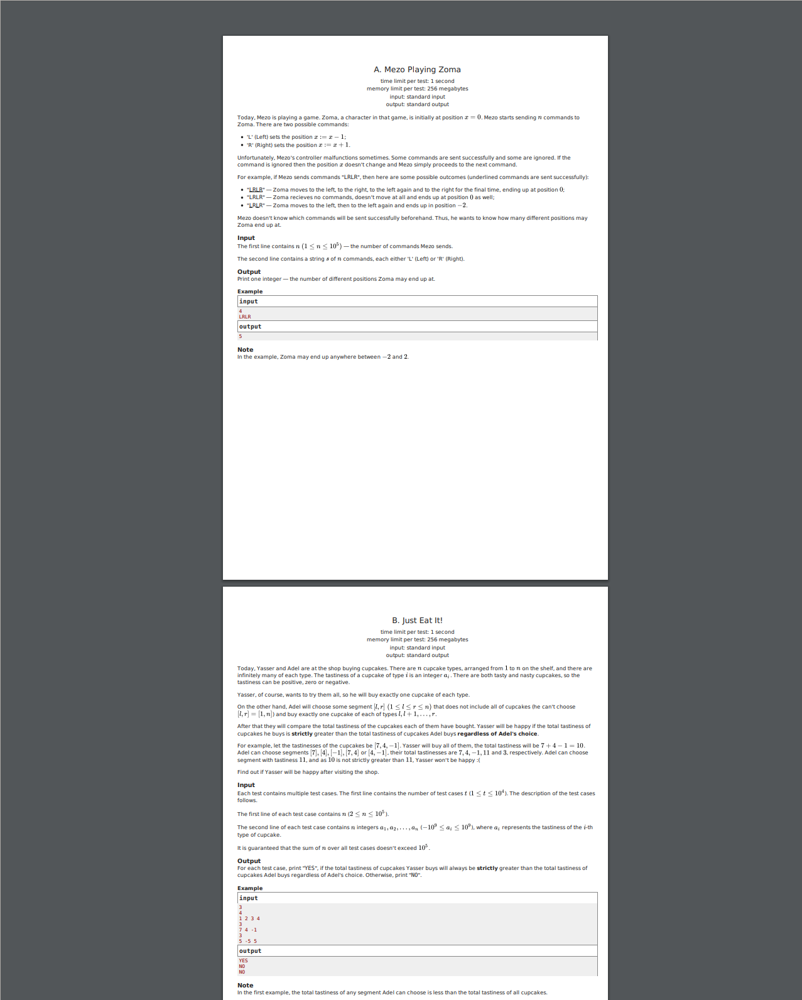

# PDF Generator for Problems on Codeforces 

```
python3 main.py 1285        # generate PDF of problems on contest 1285
python3 main.py 1285 -p A B # generate PDF of problems 1285A, 1285B
```

# demo


